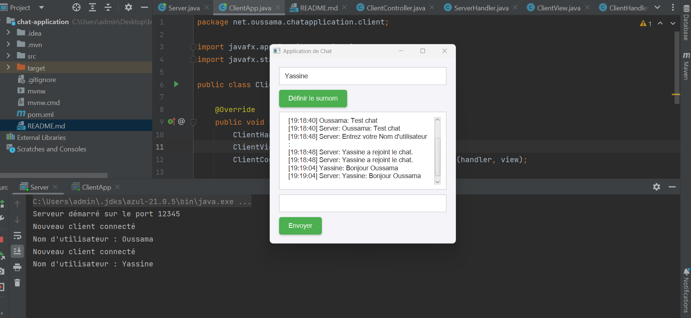

# 💬 Application de Chat avec Architecture Client-Serveur (JavaFX, Sockets, MVC)

## 🎯 Objectif
Ce projet implémente une **Application de Chat** simple utilisant l'**Architecture Client-Serveur** avec **JavaFX** pour l'interface graphique du client, et **les Sockets** pour la communication entre le serveur et le client. Le projet suit le modèle de conception **Model-View-Controller (MVC)**, ce qui permet de séparer les préoccupations de l'application pour une meilleure maintenabilité et évolutivité.

---

## 🛠️ Technologies Utilisées
- **JavaFX** pour l'interface graphique (GUI) du client.
- **Sockets** pour la communication client-serveur.
- **Threads** pour gérer plusieurs clients simultanément sur le serveur.

---

## 🗂️ Structure du Projet


Voici l'organisation du projet :

```plaintext
chat-application/
│
├── src/
│   ├── main/
│   │   ├── java/
│   │   │   ├── net/
│   │   │   │   ├── oussama/
│   │   │   │   │   ├── server/
│   │   │   │   │   │   ├── Server.java           // Serveur qui gère les connexions des clients
│   │   │   │   │   │   ├── ServerHandler.java      // Hanlder représentant les données du serveur
│   │   │   │   │   ├── client/
│   │   │   │   │   │   ├── ClientApp.java        // Point d'entrée pour le client
│   │   │   │   │   │   ├── ClientController.java // Contrôleur qui gère les actions de l'utilisateur
│   │   │   │   │   │   ├── ClientHandler.java      // Hanlder représentant les données du client
│   │   │   │   │   │   ├── ClientView.java       // Vue contenant l'interface graphique du client
│   │   ├── resources/
│   │       ├── style.css                          // Feuille CSS pour le style de l'interface graphique
│
├── module-info.java                              // Configuration des modules Java

```

## 📝 Fonctionnalités

### ✅ 1. **Serveur**
Le serveur écoute les connexions entrantes sur un port spécifique et gère plusieurs clients simultanément. Lorsqu'un message est envoyé par un client, le serveur le diffuse à tous les autres clients connectés.

### ✅ 2. **Client**
Le client se connecte au serveur via un **GUI JavaFX**. L'utilisateur peut définir un nom d'utilisateur, envoyer des messages et recevoir les messages des autres utilisateurs en temps réel.

### Capture
L’interface de l'application :





